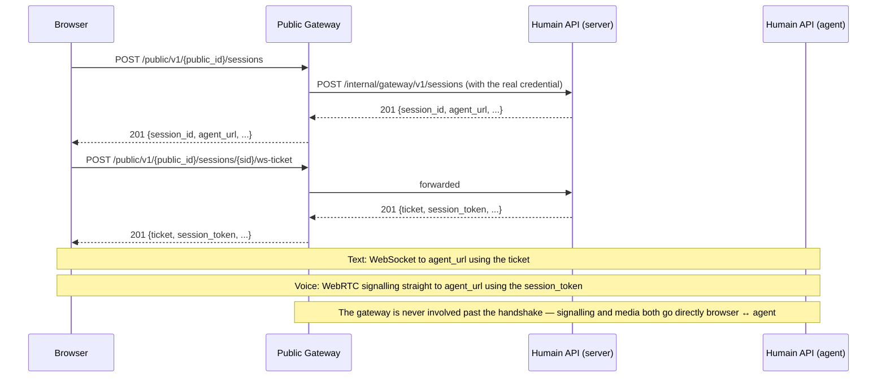

<Note>
  Not to be confused with the [SIP gateway](/voip/sip-gateway), which bridges telephone calls.
  The **Public Gateway** described on this page is for browser-side integrations — a website
  widget, a single-page app, anything that runs in a visitor's browser.
</Note>

## Overview

Every Device API call normally requires `Authorization: Bearer hk_live_…` — a long-lived secret
that must never appear in client-side code (see [Authentication](/concepts/authentication)). The
Public Gateway removes that requirement: an admin creates a **gateway endpoint** binding a
browser-safe `public_id` to a specific kiosk credential, and the browser only ever sees the
`public_id`. The gateway resolves it to the real credential server-side and forwards the request —
the raw token never crosses the network to the browser.



`public_id` (format `pub_<43-char-base64url>`) is not a credential — it identifies which gateway
endpoint to use, nothing more. Losing it doesn't expose your device credential; at worst it lets
someone open sessions against that endpoint's kiosk, which is exactly what an origin allowlist and
rate limits are for (see below).

---

## Creating a gateway endpoint

Gateway endpoints are managed in the admin panel under **Kiosk → Public Gateway**.

<Steps>
  <Step title="Bind a kiosk and credential">
    Choose the kiosk and the specific device credential this endpoint should use. One kiosk can
    have multiple gateway endpoints, each bound to a different credential.
  </Step>
  <Step title="Set the allowed origins">
    Enter the exact origins allowed to call this endpoint (e.g. `https://example.com`). Requests
    from any other `Origin` are rejected before they reach your credential.

    <Warning>
      An **empty** allowed-origins list rejects every request — it fails closed, not open. You
      must explicitly list at least one origin before the endpoint will accept any traffic.
    </Warning>
  </Step>
  <Step title="Set rate limits">
    Configure a per-minute and a burst (10-second) request limit for this endpoint. These apply
    to session-open and ws-ticket calls — the only two calls that go through the gateway. WebRTC
    signalling (offer/ice/end) never touches the gateway and is rate-limited separately, directly
    on `cmd/agent` — see [Rate limiting](#rate-limiting-and-jailing) below.
  </Step>
  <Step title="Copy the embed base URL">
    The endpoint detail page shows an **embed base URL** of the form
    `{gateway_public_url}/public/v1/{public_id}` — this is what your frontend code targets.
  </Step>
</Steps>

---

## The two public routes

All routes are under `{GATEWAY_PUBLIC_URL}/public/v1/:publicId/…` — a different host from
`https://api.humain.ai`. No `Authorization` header is sent on either of them. This is the entire
surface of the gateway — everything else a client needs (WebSocket, WebRTC signalling) talks
straight to `agent_url`, returned from the first call below.

| Route | Forwards to | Purpose |
|---|---|---|
| `POST /sessions` | `POST /v1/sessions` | Open a session. Same request/response shape as the [direct API](/concepts/session-lifecycle) — `mode`, `preferred_language`, `conversation_initiation_data` in; `session_id`, `agent_url`, `ice_servers` out. |
| `POST /sessions/:sid/ws-ticket` | `POST /v1/sessions/:sid/ws-ticket` | Mint both a WebSocket ticket (for text mode) and a **session token** (for voice signalling — see below). |

Both are pure pass-throughs to the same process that serves `POST /v1/sessions` directly: request
and response bodies are unmodified.

<Info>
  **The gateway is only in the path for these two calls.** Everything else — the WebSocket
  connection, WebRTC signalling (offer/ICE/end), and the voice media itself — goes directly
  between the browser and `agent_url`, never through the gateway. `cmd/agent` is already a
  public-facing service (real kiosk devices call it directly today), so routing signalling
  through the gateway would only add a network hop to the most latency-sensitive part of a voice
  call without adding any real security — the session token is the actual auth boundary, not
  which service forwarded the request.
</Info>

---

## Text sessions

A gateway-issued text session works exactly like the [direct WebSocket flow](/connections/websocket-streaming),
except the two handshake calls go through the gateway and skip the `Authorization` header:

```javascript
const BASE = 'https://gateway.humain.ai/public/v1/pub_your_public_id_here';

const { session_id, agent_url } = await fetch(`${BASE}/sessions`, {
  method: 'POST',
  headers: { 'Content-Type': 'application/json' },
  body: JSON.stringify({ mode: 'text' }),
}).then(r => r.json());

const { ticket } = await fetch(`${BASE}/sessions/${session_id}/ws-ticket`, {
  method: 'POST',
}).then(r => r.json());

const ws = new WebSocket(
  `${agent_url.replace('https://', 'wss://')}/v1/sessions/${session_id}/ws?ticket=${ticket}`
);
```

No credential ever appears in this flow — the WebSocket ticket is single-use and short-lived
(~30s), exactly as it is for direct API clients.

---

## Voice sessions and the session token

WebRTC signalling calls (`webrtc/offer`, `webrtc/ice`, `end`) go straight to `agent_url`, not the
gateway — but they still can't reuse the WebSocket ticket, since a voice call needs authorization
across one offer, an unbounded number of trickled ICE candidates, and an eventual `end` that
might arrive minutes later, while the WS ticket is deliberately single-use. `POST
/sessions/:sid/ws-ticket` mints a second token for this — a **session token** — alongside the WS
ticket:

```json
{
  "ticket": "…",
  "expires_in": 30,
  "session_token": "…",
  "session_token_expires_in": 14400
}
```

Send it as `X-Session-Token` on every signalling call, made directly against `agent_url` (from
the session-open response) rather than the gateway's `BASE`:

```javascript
// session_id and agent_url both come from the earlier POST {BASE}/sessions call.
const { session_token } = await fetch(`${BASE}/sessions/${session_id}/ws-ticket`, {
  method: 'POST',
}).then(r => r.json());

await fetch(`${agent_url}/v1/sessions/${session_id}/webrtc/offer`, {
  method: 'POST',
  headers: { 'Content-Type': 'application/json', 'X-Session-Token': session_token },
  body: JSON.stringify({ sdp: offer.sdp }),
});
```

`cmd/agent`'s CORS allows any origin for the session-token-authorized signalling routes, so this
cross-origin call from your embed domain works without the gateway proxying it.

Unlike the WS ticket, the session token is **multi-use** — it stays valid for as long as the
session itself does, so it authorizes the offer call, every ICE candidate, and the eventual
`end` call (also sent directly to `agent_url`, with the same header). Ending the session (or
letting it time out) invalidates the token immediately; there is no separate revocation step.

---

## Rate limiting and jailing

Session-open and ws-ticket calls — the only two that go through the gateway — are rate-limited
per (endpoint, client IP) using the endpoint's configured per-minute and burst limits.

WebRTC signalling calls never touch the gateway, so they're not covered by that limit at all.
They're rate-limited separately, directly on `cmd/agent`, keyed on (session, client IP): 300
requests/min with a burst of 60 per 10s — sized generously enough that a voice call trickling a
dozen or more ICE candidates in the first couple of seconds never trips it. The session token is
the actual security boundary for these calls, not which service forwarded the request, so this
limit protects them the same way the gateway's limit protects session-open.

A client that repeatedly trips input screening (see below) or otherwise misbehaves is
temporarily jailed — every request from that IP to that endpoint is rejected with
`403 ENDPOINT_JAILED` and a `Retry-After` header until the jail expires.

Session-open bodies are also screened for prompt-injection and jailbreak patterns in any
user-supplied `variables` — a hit is rejected with `400 INPUT_REJECTED` and counts toward the
jail threshold. This is on top of the identical screening the turn pipeline performs once a
session is actually talking to the LLM; the gateway check exists to keep abusive traffic from
reaching your kiosk at all.

---

## Allowed modes

If a gateway endpoint has a non-empty **allowed modes** list configured, `POST /sessions`
rejects any `mode` not on that list with `403 MODE_NOT_ALLOWED`. Leave the list empty to allow
any mode the underlying credential supports.

---

## Error codes

| Code | HTTP | When |
|---|---|---|
| `ENDPOINT_NOT_FOUND` | 404 | The `public_id` doesn't exist, or the endpoint is disabled. |
| `ORIGIN_NOT_ALLOWED` | 403 | The request's `Origin` isn't on the endpoint's allowlist. |
| `ENDPOINT_JAILED` | 403 | This client IP is temporarily blocked for this endpoint — see `details.retry_after_seconds`. |
| `MODE_NOT_ALLOWED` | 403 | The requested `mode` isn't in the endpoint's allowed modes. |
| `RATE_LIMITED` | 429 | Too many requests — see `details.retry_after_seconds`. |
| `INPUT_REJECTED` | 400 | A session-open variable was screened and rejected. |

All other errors pass through unmodified from whichever upstream (`cmd/server` or the agent)
generated them — see [Error codes](/concepts/error-codes) for the full reference.
