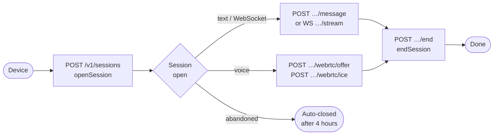

## Overview



Each conversation starts by calling `POST /v1/sessions`, which returns a `session_id`. Every
subsequent request for that conversation includes the `session_id` in the URL. When the conversation
ends, call `POST /v1/sessions/{sid}/end` to close it cleanly.

## Lifecycle stages

<Steps>
  <Step title="Open">
    `POST /v1/sessions` creates the session. At this point the server:
    - Resolves the credential to a kiosk and workspace.
    - Loads the knowledge base and guardrail rules into a fast cache.
    - Runs `OnSessionStart` fraud checks.
    - Returns a `session_id` (UUID).

    ```json
    // Response: 201 Created
    { "session_id": "3fa85f64-5717-4562-b3fc-2c963f66afa6" }
    ```
  </Step>
  <Step title="Interact">
    While the session is open, the device sends messages (text mode), streams real-time audio
    (voice mode), or bridges a telephone call (voip mode). Each turn runs through the full pipeline:

    1. FraudGuard checks the input.
    2. Guardrail rules gate the input.
    3. The prompt is built (persona + knowledge + history).
    4. The LLM generates a response.
    5. Tool calls are executed (up to 5 per turn).
    6. Guardrail rules check the output (PII, blocked phrases).
    7. Conversation history is updated.
  </Step>
  <Step title="End">
    `POST /v1/sessions/{sid}/end` closes the session. The server:
    - Flushes all usage events to the database.
    - Releases the WebRTC peer connection if one exists.
    - Marks the session as closed.

    This endpoint returns `204 No Content`. Calling it on an already-closed session returns
    `400 SESSION_ENDED`.
  </Step>
</Steps>

## Conversation history

The server maintains a rolling conversation history for the duration of the session. History is
**trimmed automatically** when it approaches 8,000 tokens — the two most recent turns are always
preserved regardless of length.

History is **not persisted** after the session ends. If you need conversation logs, listen to the
usage events or build your own persistence layer on top of the API.

## Abandoned sessions

If the device disconnects without calling `POST /v1/sessions/{sid}/end`, the session is cleaned up
automatically:

- A background worker scans for idle sessions periodically.
- Sessions with no activity for **4 hours** are marked abandoned and closed.
- Usage data is flushed as part of the cleanup.

<Note>
  Abandoned sessions count toward your plan's usage. Always call `end` when the conversation
  is genuinely finished to keep your metrics accurate.
</Note>

## Concurrent sessions

A single device credential can hold multiple concurrent sessions — for example, a kiosk with
multiple simultaneous users. Each session is independent: separate history, separate rate limits,
separate guardrail counters.

## Session and credential limits

| Limit | Scope | Default |
|---|---|---|
| Burst rate limit | Per credential (10-second window) | Configurable in admin |
| Sustained rate limit | Per session | Configurable in guardrail rules |
| Conversation history | Per session | 8,000 tokens |
| Tool calls per turn | Per session | 5 |
| Auto-abandonment | Per session | 4 hours of inactivity |
