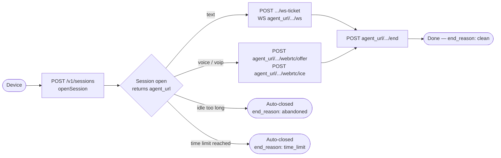

## Overview



Each conversation starts by calling `POST /v1/sessions`, which returns a `session_id` and an
`agent_url`. Every subsequent real-time call for that conversation — the WebSocket, WebRTC
signalling, and `end` — goes to `agent_url`, not necessarily the host that served the open
request. When the conversation ends, call `POST {agent_url}/v1/sessions/{sid}/end` to close it
cleanly.

<Note>
  `agent_url` exists because the WebSocket/WebRTC connection is served by a separate, stateless
  process from the one that opens sessions. In most deployments it resolves to the same public
  API host behind a reverse proxy — treat the value as opaque and always use what the response
  returns rather than assuming it equals your base URL.
</Note>

## Lifecycle stages

<Steps>
  <Step title="Open">
    `POST /v1/sessions` creates the session. At this point the server:
    - Resolves the credential to a kiosk and workspace.
    - Loads the knowledge base and guardrail rules into a fast cache.
    - Runs `OnSessionStart` fraud checks.
    - Returns a `session_id` (UUID) and an `agent_url`.

    ```json
    // Response: 201 Created
    {
      "session_id": "3fa85f64-5717-4562-b3fc-2c963f66afa6",
      "agent_url": "https://api.humain.ai",
      "detected_language": "tr"
    }
    ```

    `agent_url` is the base URL for every subsequent real-time call — see the note above.
    `detected_language` currently just echoes the `preferred_language` you sent (no real
    detection yet); it is omitted if you didn't send one. A `disclosure_text` field is planned
    for a future EU AI Act disclosure feature but is not populated by the server today.
    `ice_servers` (TURN/STUN credentials) is included only when TURN relay is configured for
    your workspace — see [WebRTC voice](/connections/webrtc-voice).

    See [Language support](/concepts/language-support) for how to send `preferred_language`.
  </Step>
  <Step title="Interact">
    While the session is open, the device sends messages over a WebSocket (text mode), streams
    real-time audio over WebRTC (voice mode), or bridges a telephone call (voip mode). Each turn
    runs through the full pipeline:

    1. FraudGuard checks the input.
    2. Guardrail rules gate the input.
    3. The prompt is built (persona + knowledge + history).
    4. The LLM generates a response.
    5. Tool calls are executed (up to 5 per turn).
    6. Guardrail rules check the output (PII, blocked phrases).
    7. Conversation history is updated.

    There is no raw REST endpoint for a text turn — see
    [WebSocket streaming](/connections/websocket-streaming) for the wire protocol.
  </Step>
  <Step title="End">
    `POST {agent_url}/v1/sessions/{sid}/end` closes the session. The server:
    - Flushes all usage events to the database.
    - Releases the WebRTC peer connection if one exists.
    - Marks the session as closed with `end_reason: clean`.

    This endpoint returns `204 No Content`. Calling it on an already-closed session returns
    `400 SESSION_ENDED`.
  </Step>
</Steps>

## Conversation history

The server maintains a rolling conversation history for the duration of the session. History is
**trimmed automatically** when it approaches 8,000 tokens — the two most recent turns are always
preserved regardless of length.

History is **not persisted** after the session ends. If you need conversation logs, listen to the
usage events or build your own persistence layer on top of the API.

## Automatic session closure

Two independent mechanisms can close a session without the device calling `end`:

**Hard time limit** — every session has a maximum duration (default 4 hours, overridable per
kiosk by a `session_time_limit` guardrail rule). 60 seconds before the deadline, the WebSocket
sends a `session_expiring` warning frame (or, for voice, a `session_expiring` event on the
WebRTC `control` data channel); at the deadline the connection is closed with
`end_reason: time_limit`. Reconnecting after this point returns `SESSION_ENDED`.

**Idle abandonment** — a background worker sweeps for sessions with no activity on a fixed
interval and closes genuinely idle or disconnected sessions with `end_reason: abandoned`. Usage
data is flushed as part of the cleanup either way.

<Note>
  Both `time_limit` and `abandoned` closures count toward your plan's usage. Always call `end`
  explicitly (`end_reason: clean`) when the conversation is genuinely finished — it's faster and
  keeps your analytics accurate.
</Note>

## Concurrent sessions

A single device credential can hold multiple concurrent sessions — for example, a kiosk with
multiple simultaneous users. Each session is independent: separate history, separate rate limits,
separate guardrail counters.

## Session and credential limits

| Limit | Scope | Default |
|---|---|---|
| Burst rate limit | Per credential (10-second window) | Configurable in admin |
| Sustained rate limit | Per session | Configurable in guardrail rules |
| Conversation history | Per session | 8,000 tokens |
| Tool calls per turn | Per session | 5 |
| Session time limit | Per session | 4 hours (overridable by `session_time_limit` guardrail) |
| Session expiry warning | Before time limit | 60 seconds |
| Idle abandonment sweep | Background worker | Runs on a fixed interval |
