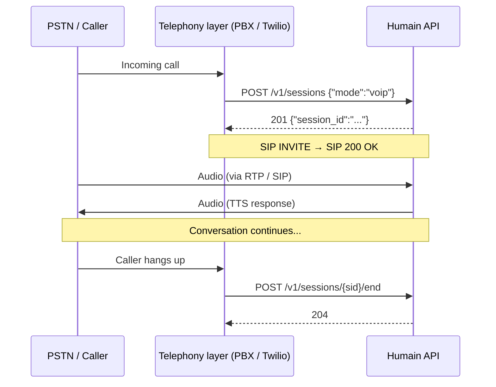

## Overview

VoIP mode lets you connect a PSTN phone line or SIP trunk to the Humain AI. Unlike WebRTC, there
is no browser or special client library required — your PBX or VoIP adapter handles the telephony;
Humain handles the AI.

<Info>
  VoIP mode is configured in the admin panel under **Kiosk → Voice settings → VoIP / SIP**.
  Contact [support@humain.ai](mailto:support@humain.ai) to enable the SIP endpoint for your
  workspace.
</Info>

## Integration paths

<Columns cols={2}>
  <Card title="SIP trunk (PBX)" icon="server">
    Configure your PBX (Asterisk, FreeSWITCH, 3CX, or any SIP-compatible system) to route
    calls to the Humain SIP endpoint. Best for high-volume call centres with existing
    telephony infrastructure.
  </Card>
  <Card title="VoIP adapter (ATA)" icon="plug">
    Plug an Analog Telephone Adapter between an analogue phone line and your network. The ATA
    converts PSTN audio to SIP. Best for physical kiosk terminals with a dedicated phone handset.
  </Card>
  <Card title="Twilio / CPaaS bridge" icon="cloud">
    Use a Twilio Studio flow or similar CPaaS to forward calls to the Humain SIP endpoint.
    Lets you add SMS fallback, recording, and call analytics on top of the Humain AI.
  </Card>
  <Card title="Mobile app (SIP client)" icon="mobile">
    Embed a SIP stack (PJSIP, linphone) in your iOS/Android app. The app registers against
    the Humain SIP endpoint and calls are handled like any other SIP call.
  </Card>
</Columns>

## Session flow

A VoIP session still uses the Device API. Your server-side integration (PBX dialplan, Twilio webhook,
etc.) calls the Humain API to open and close sessions. The audio bridge is handled transparently.



## Configuration checklist

<Steps>
  <Step title="Enable VoIP for your kiosk">
    In the admin panel, open your kiosk and navigate to **Voice settings → VoIP / SIP**.
    Toggle VoIP on and note the assigned SIP URI (e.g. `sip:kiosk-abc123@sip.humain.ai`).
  </Step>
  <Step title="Configure your telephony layer">
    Point your PBX, ATA, or CPaaS at the Humain SIP endpoint. Use the SIP URI from the
    previous step. TLS and SRTP are required — plain SIP is not supported.
  </Step>
  <Step title="Open sessions programmatically">
    When an inbound call arrives, your server-side webhook calls `POST /v1/sessions` with
    `mode: "voip"` before accepting the SIP INVITE.

    ```bash
    curl -X POST https://api.humain.ai/v1/sessions \
      -H "Authorization: Bearer hk_live_YOUR_TOKEN" \
      -H "Content-Type: application/json" \
      -d '{"mode":"voip"}'
    ```
  </Step>
  <Step title="Close sessions on hang-up">
    When the caller hangs up, call `POST /v1/sessions/{sid}/end` to flush usage data.
  </Step>
</Steps>

## Supported codecs

| Codec | Support |
|---|---|
| G.711 μ-law (PCMU) | ✅ Supported |
| G.711 A-law (PCMA) | ✅ Supported |
| G.722 (HD voice) | ✅ Supported |
| Opus | ✅ Supported |
| G.729 | ❌ Not supported |

<Note>
  For best transcription accuracy, prefer G.722 (wideband) or Opus over G.711 narrowband.
  Deepgram's STT performs significantly better at 16 kHz+ audio.
</Note>

## Security

All SIP signalling uses TLS (port 5061). Media uses SRTP. Plain SIP on port 5060 is rejected
at the network edge. Ensure your PBX or ATA supports TLS/SRTP before attempting to connect.
