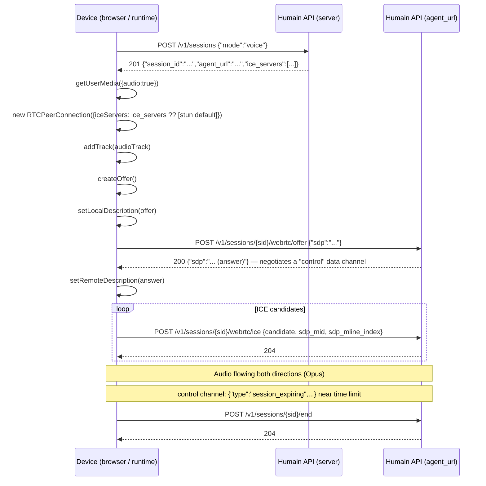

## Architecture

The voice pipeline runs entirely server-side. Your device streams Opus-encoded audio frames over a
single WebRTC connection; the server processes speech, inference, and synthesis in a unified
streaming loop. You never need to call a transcription or TTS API yourself.

**Key characteristics:**
- **Codec** — Opus, 48 kHz, mono
- **VAD** — server-side, 600 ms silence threshold
- **Barge-in** — the user can interrupt mid-response; the AI stops immediately
- **Latency** — typically 80–150 ms from end of speech to first audio frame back

### Gemini Live architecture

Voice sessions use **Gemini Live** — a single bidirectional WebSocket between the Humain server
and Google's Gemini model that carries compressed audio in both directions. This replaces the
previous STT → LLM → TTS chain with a single model that handles all three stages natively.

```
Old pipeline:    Audio → Deepgram STT → Gemini text → ElevenLabs TTS → Audio
Gemini Live:     Audio → Gemini Live (audio-in / audio-out) → Audio
```

| Metric | STT + LLM + TTS chain | Gemini Live |
|---|---|---|
| End-to-speech latency (typical) | 600–900 ms | 80–150 ms |
| Language support | STT languages only | 90+ languages natively |
| Pipeline hops | 3 (STT, LLM, TTS) | 1 (Gemini Live) |
| Per-language configuration | Separate STT/TTS voices per language | Single model, language-aware |

<Note>
  Gemini Live supports 90+ languages natively — you do not need to configure separate
  STT or TTS voices per language. Set `preferred_language` on the session open request and
  the model speaks that language automatically. See [Language support](/concepts/language-support).
</Note>

## Connection sequence



<Note>
  `agent_url` is the base URL for both WebRTC signalling calls and `end` — it may differ from
  the host that served `POST /v1/sessions`. `ice_servers` (TURN/STUN credentials) is only present
  in the response when TURN relay is configured for your workspace; fall back to a public STUN
  server when it's absent, as shown below.
</Note>

## Browser integration

```javascript
const TOKEN = 'hk_live_your_credential_here';
const BASE  = 'https://api.humain.ai';

async function startVoiceSession() {
  // ─── 1. Open a voice session ───────────────────────────────────────────────
  const { session_id, agent_url, ice_servers } = await fetch(`${BASE}/v1/sessions`, {
    method: 'POST',
    headers: { 'Authorization': `Bearer ${TOKEN}`, 'Content-Type': 'application/json' },
    body: JSON.stringify({ mode: 'voice' }),
  }).then(r => r.json());

  // Every subsequent call (offer, ice, end) goes to agent_url, not BASE.

  // ─── 2. Get microphone access ──────────────────────────────────────────────
  const stream = await navigator.mediaDevices.getUserMedia({ audio: true, video: false });

  // ─── 3. Create RTCPeerConnection ───────────────────────────────────────────
  // Use ice_servers from the session-open response when present (TURN configured
  // for your workspace); otherwise fall back to a public STUN server.
  const pc = new RTCPeerConnection({
    iceServers: ice_servers?.length ? ice_servers : [{ urls: 'stun:stun.l.google.com:19302' }],
  });

  // Add local audio track
  for (const track of stream.getTracks()) {
    pc.addTrack(track, stream);
  }

  // Play remote (AI) audio
  pc.ontrack = (event) => {
    const audio = document.createElement('audio');
    audio.autoplay = true;
    audio.srcObject = event.streams[0];
    document.body.appendChild(audio);
  };

  // Negotiated data channel for control events (session_expiring, error).
  // Must match the server's channel exactly: id 0, negotiated.
  const controlChannel = pc.createDataChannel('control', { negotiated: true, id: 0 });
  controlChannel.onmessage = (event) => {
    const msg = JSON.parse(event.data);
    if (msg.type === 'session_expiring') {
      showWarningBanner(`Session ending in ${msg.seconds_left}s`);
    }
    if (msg.type === 'error' && msg.code === 'SESSION_ENDED') {
      // Server will close the peer connection next — clean up your UI here.
    }
  };

  // ─── 4. Create SDP offer ──────────────────────────────────────────────────
  const offer = await pc.createOffer();
  await pc.setLocalDescription(offer);

  // ─── 5. Exchange offer/answer with the server ─────────────────────────────
  const offerRes = await fetch(
    `${agent_url}/v1/sessions/${session_id}/webrtc/offer`,
    {
      method: 'POST',
      headers: { 'Authorization': `Bearer ${TOKEN}`, 'Content-Type': 'application/json' },
      body: JSON.stringify({ sdp: offer.sdp }),
    }
  );
  const offerData = await offerRes.json();
  if (!offerRes.ok) {
    // e.g. INVALID_MODE (session isn't voice/voip) or VOICE_NOT_ENABLED (503)
    throw new Error(`${offerData.error}: ${offerData.message}`);
  }

  await pc.setRemoteDescription({ type: 'answer', sdp: offerData.sdp });

  // ─── 6. Send ICE candidates ────────────────────────────────────────────────
  pc.onicecandidate = async ({ candidate }) => {
    if (!candidate) return; // null signals end of candidates
    await fetch(`${agent_url}/v1/sessions/${session_id}/webrtc/ice`, {
      method: 'POST',
      headers: { 'Authorization': `Bearer ${TOKEN}`, 'Content-Type': 'application/json' },
      body: JSON.stringify({
        candidate:       candidate.candidate,
        sdp_mid:         candidate.sdpMid,
        sdp_mline_index: candidate.sdpMLineIndex,
      }),
    });
  };

  // ─── 7. End session when done ──────────────────────────────────────────────
  return async function endSession() {
    stream.getTracks().forEach(t => t.stop());
    pc.close();
    await fetch(`${agent_url}/v1/sessions/${session_id}/end`, {
      method: 'POST',
      headers: { 'Authorization': `Bearer ${TOKEN}` },
    });
  };
}

// Usage
const endSession = await startVoiceSession();
// ... later, when the user clicks "End call":
await endSession();
```

## VAD and barge-in behaviour

You do not need to manage push-to-talk. The server detects end-of-utterance server-side:

- **VAD threshold** — 600 ms of silence triggers end-of-utterance detection.
- **Barge-in** — if the AI is speaking and the user starts talking, the server detects the
  interruption and stops the TTS stream immediately. The user's speech is processed as a new turn.

<Note>
  There is no API to configure the VAD threshold per session — it is set globally per kiosk in
  the admin panel under **Kiosk → Voice settings → VAD sensitivity**.
</Note>

## Advanced topics

<AccordionGroup>
  <Accordion title="Using TURN servers">
    In NAT-heavy environments (cellular networks, corporate firewalls) STUN alone may not
    establish a peer connection. If your workspace has TURN configured server-side, the
    session-open response includes an `ice_servers` array with time-limited credentials — pass
    it straight to `RTCPeerConnection` as shown in the example above:

    ```javascript
    const { ice_servers } = await openSessionResponse.json();
    const pc = new RTCPeerConnection({
      iceServers: ice_servers?.length ? ice_servers : [{ urls: 'stun:stun.l.google.com:19302' }],
    });
    ```

    TURN relay itself is configured per-deployment on the server side (contact your Humain
    workspace admin, or see the self-hosted [coturn](https://github.com/coturn/coturn) setup in
    `kiosk-infra` if you run your own cluster) — clients don't provision or hold long-lived TURN
    credentials themselves.
  </Accordion>
  <Accordion title="Server-side runtimes (non-browser)">
    For embedded Linux devices or server-side Go/Python code that speaks WebRTC:

    - **Go** — [pion/webrtc](https://github.com/pion/webrtc) — the same library Humain uses
      internally.
    - **Python** — [aiortc](https://github.com/aiortc/aiortc) — asyncio-based, supports
      Linux ARM (Raspberry Pi, Jetson Nano).
    - **Rust** — [webrtc-rs](https://github.com/webrtc-rs/webrtc)

    The SDP exchange and ICE flow are identical — only the peer connection API differs.
  </Accordion>
  <Accordion title="Detecting connection state">
    Listen to `pc.onconnectionstatechange` to surface connection issues to the user:

    ```javascript
    pc.onconnectionstatechange = () => {
      switch (pc.connectionState) {
        case 'connected':    showStatus('Listening…'); break;
        case 'disconnected': showStatus('Connection lost — reconnecting…'); break;
        case 'failed':       showStatus('Connection failed. Please try again.'); break;
        case 'closed':       showStatus('Call ended.'); break;
      }
    };
    ```
  </Accordion>
</AccordionGroup>
