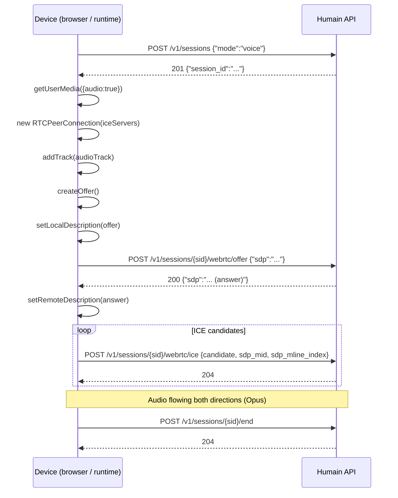

## Architecture

The voice pipeline runs entirely server-side. Your device streams Opus-encoded audio frames; the
server handles STT (Deepgram), LLM inference, and TTS synthesis (ElevenLabs) in a single
streaming loop. You never need to call a transcription or TTS API yourself.

**Key characteristics:**
- **Codec** — Opus, 48 kHz, mono
- **VAD** — server-side, 600 ms silence threshold
- **Barge-in** — the user can interrupt mid-response; the AI stops immediately
- **Latency** — typically 150–250 ms from end of speech to first audio frame back

## Connection sequence



## Browser integration

```javascript
const TOKEN = 'hk_live_YOUR_TOKEN';
const BASE  = 'https://api.humain.ai';

async function startVoiceSession() {
  // ─── 1. Open a voice session ───────────────────────────────────────────────
  const { session_id } = await fetch(`${BASE}/v1/sessions`, {
    method: 'POST',
    headers: { 'Authorization': `Bearer ${TOKEN}`, 'Content-Type': 'application/json' },
    body: JSON.stringify({ mode: 'voice' }),
  }).then(r => r.json());

  // ─── 2. Get microphone access ──────────────────────────────────────────────
  const stream = await navigator.mediaDevices.getUserMedia({ audio: true, video: false });

  // ─── 3. Create RTCPeerConnection ───────────────────────────────────────────
  const pc = new RTCPeerConnection({
    iceServers: [{ urls: 'stun:stun.l.google.com:19302' }],
  });

  // Add local audio track
  for (const track of stream.getTracks()) {
    pc.addTrack(track, stream);
  }

  // Play remote (AI) audio
  pc.ontrack = (event) => {
    const audio = document.createElement('audio');
    audio.autoplay = true;
    audio.srcObject = event.streams[0];
    document.body.appendChild(audio);
  };

  // ─── 4. Create SDP offer ──────────────────────────────────────────────────
  const offer = await pc.createOffer();
  await pc.setLocalDescription(offer);

  // ─── 5. Exchange offer/answer with the server ─────────────────────────────
  const { sdp: answerSDP } = await fetch(
    `${BASE}/v1/sessions/${session_id}/webrtc/offer`,
    {
      method: 'POST',
      headers: { 'Authorization': `Bearer ${TOKEN}`, 'Content-Type': 'application/json' },
      body: JSON.stringify({ sdp: offer.sdp }),
    }
  ).then(r => r.json());

  await pc.setRemoteDescription({ type: 'answer', sdp: answerSDP });

  // ─── 6. Send ICE candidates ────────────────────────────────────────────────
  pc.onicecandidate = async ({ candidate }) => {
    if (!candidate) return; // null signals end of candidates
    await fetch(`${BASE}/v1/sessions/${session_id}/webrtc/ice`, {
      method: 'POST',
      headers: { 'Authorization': `Bearer ${TOKEN}`, 'Content-Type': 'application/json' },
      body: JSON.stringify({
        candidate:       candidate.candidate,
        sdp_mid:         candidate.sdpMid,
        sdp_mline_index: candidate.sdpMLineIndex,
      }),
    });
  };

  // ─── 7. End session when done ──────────────────────────────────────────────
  return async function endSession() {
    stream.getTracks().forEach(t => t.stop());
    pc.close();
    await fetch(`${BASE}/v1/sessions/${session_id}/end`, {
      method: 'POST',
      headers: { 'Authorization': `Bearer ${TOKEN}` },
    });
  };
}

// Usage
const endSession = await startVoiceSession();
// ... later, when the user clicks "End call":
await endSession();
```

## VAD and barge-in behaviour

You do not need to manage push-to-talk. The server detects end-of-utterance server-side:

- **VAD threshold** — 600 ms of silence triggers end-of-utterance detection.
- **Barge-in** — if the AI is speaking and the user starts talking, the server detects the
  interruption and stops the TTS stream immediately. The user's speech is processed as a new turn.

<Note>
  There is no API to configure the VAD threshold per session — it is set globally per kiosk in
  the admin panel under **Kiosk → Voice settings → VAD sensitivity**.
</Note>

## Advanced topics

<AccordionGroup>
  <Accordion title="TURN server configuration">
    In NAT-heavy environments (cellular networks, corporate firewalls) STUN alone may not
    establish a peer connection. Configure a TURN relay:

    ```javascript
    const pc = new RTCPeerConnection({
      iceServers: [
        { urls: 'stun:stun.l.google.com:19302' },
        {
          urls: 'turn:turn.example.com:3478',
          username: 'myuser',
          credential: 'mypassword',
        },
      ],
    });
    ```

    You can provision a TURN server with [coturn](https://github.com/coturn/coturn) or use a
    managed service (Twilio, Metered.ca, Cloudflare Calls).
  </Accordion>
  <Accordion title="Server-side runtimes (non-browser)">
    For embedded Linux devices or server-side Go/Python code that speaks WebRTC:

    - **Go** — [pion/webrtc](https://github.com/pion/webrtc) — the same library Humain uses
      internally.
    - **Python** — [aiortc](https://github.com/aiortc/aiortc) — asyncio-based, supports
      Linux ARM (Raspberry Pi, Jetson Nano).
    - **Rust** — [webrtc-rs](https://github.com/webrtc-rs/webrtc)

    The SDP exchange and ICE flow are identical — only the peer connection API differs.
  </Accordion>
  <Accordion title="Detecting connection state">
    Listen to `pc.onconnectionstatechange` to surface connection issues to the user:

    ```javascript
    pc.onconnectionstatechange = () => {
      switch (pc.connectionState) {
        case 'connected':    showStatus('Listening…'); break;
        case 'disconnected': showStatus('Connection lost — reconnecting…'); break;
        case 'failed':       showStatus('Connection failed. Please try again.'); break;
        case 'closed':       showStatus('Call ended.'); break;
      }
    };
    ```
  </Accordion>
</AccordionGroup>
