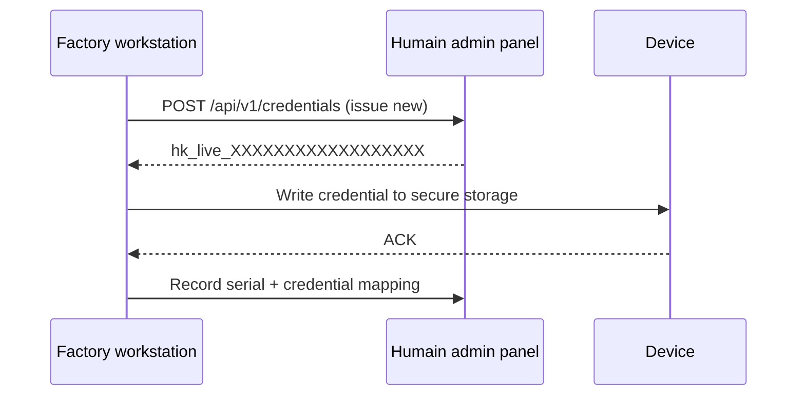

---
title: "Credential management"
description: "Secure credential storage on embedded targets — environment files, dm-crypt, ATECC608 secure element, and TPM 2.0."
icon: "key"
---

A Humain Kiosk credential (`hk_live_…`) is equivalent to a long-lived API password. It must
be stored securely on the device, retrieved at runtime, and rotatable without re-flashing
firmware.

**Issue one credential per physical device.** If a device is compromised, only that device's
credential is revoked — shared credentials across devices require revoking access for all of
them simultaneously.

---

## Storage options

<Tabs>
  <Tab title="Environment file (Linux)">
    The simplest option for embedded Linux and Raspberry Pi. Store the credential in a
    root-readable file and pass it to the process via systemd's `EnvironmentFile` directive.

    ```bash
    # Write the credential
    sudo bash -c 'echo "HUMAIN_CREDENTIAL=hk_live_your_credential_here" > /etc/humain.env'
    sudo chmod 600 /etc/humain.env
    sudo chown root:root /etc/humain.env
    ```

    ```ini
    # /etc/systemd/system/humain-kiosk.service
    [Service]
    EnvironmentFile=/etc/humain.env
    ExecStart=/usr/local/bin/humain-kiosk
    ```

    Read in C:

    ```c
    const char *cred = getenv("HUMAIN_CREDENTIAL");
    ```

    **Security:** The credential is stored in plaintext on disk. Anyone with root access can
    read it. Appropriate for deployments where physical access to the device is controlled.
  </Tab>

  <Tab title="dm-crypt (encrypted disk)">
    For higher assurance on embedded Linux, store the credential on an encrypted partition.
    `dm-crypt` + LUKS2 encrypts the partition at rest; the decryption key can be derived from
    a TPM or hardware token.

    ```bash
    # Create and format an encrypted credential partition (first-time setup)
    sudo cryptsetup luksFormat --type luks2 /dev/mmcblk0p3
    sudo cryptsetup open /dev/mmcblk0p3 humain-creds
    sudo mkfs.ext4 /dev/mapper/humain-creds
    sudo mount /dev/mapper/humain-creds /mnt/humain-creds

    # Write the credential file
    sudo bash -c 'echo "HUMAIN_CREDENTIAL=hk_live_your_credential_here" \
        > /mnt/humain-creds/credential.env'
    sudo chmod 600 /mnt/humain-creds/credential.env

    # Unmount
    sudo umount /mnt/humain-creds
    sudo cryptsetup close humain-creds
    ```

    To auto-unlock at boot using a TPM2 policy, use `systemd-cryptenroll`:

    ```bash
    sudo systemd-cryptenroll --tpm2-device=auto /dev/mmcblk0p3
    ```

    Add to `/etc/crypttab`:

    ```text
    humain-creds /dev/mmcblk0p3 none tpm2-device=auto
    ```

    **Security:** The credential is encrypted at rest and unlocked automatically by the TPM on
    the correct hardware. Cloning the SD card to another device will not expose the credential.
  </Tab>

  <Tab title="ATECC608 (secure element)">
    Microchip ATECC608A/B is a purpose-built secure element that stores secrets in tamper-resistant
    hardware. It communicates over I²C and is widely available as a breakout board or as an
    integrated component on development kits (e.g., Espressif ESP32-S3 DevKit-C with ATECC608).

    The credential is stored in one of the ATECC608's 16 key slots. To read it, the host MCU
    sends a signed challenge — the element returns the credential only after verifying the
    host's identity. The secret never leaves the chip in cleartext.

    ```c
    /* Pseudocode — use your ATECC608 HAL library (e.g., cryptoauthlib) */
    #include "cryptoauthlib.h"

    #define CREDENTIAL_SLOT 5   /* Use any unused slot */

    static char credential[72]; /* hk_live_ + 43 chars + NUL */

    bool load_credential_from_atecc(void) {
        ATCA_STATUS status = atcab_init(&cfg_ateccx08a_i2c);
        if (status != ATCA_SUCCESS) return false;

        uint8_t raw[64] = {0};
        status = atcab_read_bytes_zone(ATCA_ZONE_DATA, CREDENTIAL_SLOT, 0, raw, sizeof(raw));
        if (status != ATCA_SUCCESS) return false;

        memcpy(credential, raw, 71);
        credential[71] = '\0';
        return true;
    }
    ```

    Provisioning is performed in a secure factory environment using the ATECC608's personalisation
    workflow — see Microchip's [Trust Platform Design Suite](https://www.microchip.com/en-us/product/atecc608a).
  </Tab>

  <Tab title="TPM 2.0 (Linux)">
    Trusted Platform Module 2.0 chips are available on many industrial SBCs and x86 embedded
    systems. Use `tpm2-tools` to seal the credential under a TPM policy.

    ```bash
    # Install tools
    sudo apt install tpm2-tools

    # Write the credential into a sealed blob, authorised by current PCR state
    echo -n "hk_live_your_credential_here" | \
        tpm2_create \
            --parent-context primary.ctx \
            --sealing-input - \
            --key-context sealed.ctx \
            --attributes "noda|adminwithpolicy|fixedtpm|fixedparent"

    sudo mv sealed.ctx /etc/humain-sealed.ctx
    sudo chmod 600 /etc/humain-sealed.ctx
    ```

    Read the credential at runtime:

    ```bash
    HUMAIN_CREDENTIAL=$(tpm2_unseal --object-context /etc/humain-sealed.ctx)
    export HUMAIN_CREDENTIAL
    /usr/local/bin/humain-kiosk
    ```

    Or in a systemd unit using `ExecStartPre`:

    ```ini
    [Service]
    ExecStartPre=/bin/sh -c \
        'tpm2_unseal --object-context /etc/humain-sealed.ctx > /run/humain-credential'
    ExecStart=/bin/sh -c \
        'HUMAIN_CREDENTIAL=$(cat /run/humain-credential) exec /usr/local/bin/humain-kiosk'
    ExecStopPost=/bin/rm -f /run/humain-credential
    RuntimeDirectory=humain
    RuntimeDirectoryMode=0700
    ```

    **Security:** The credential is only accessible when the TPM's PCR measurements match the
    expected boot state — i.e., the expected firmware, bootloader, and OS are running.
    Tampering with the boot chain prevents unsealing.
  </Tab>
</Tabs>

---

## Provisioning flow

For factory provisioning of many devices:



Use the admin API to issue credentials programmatically rather than copying them by hand:

```bash
# Issue a new credential for device serial SN-1234
curl -s -X POST https://api.humain.ai/api/v1/kiosks/{kiosk_id}/credentials \
  -H "Cookie: __session=admin_session_token" \
  -H "Content-Type: application/json" \
  -d '{"label": "SN-1234", "description": "Factory provisioned 2026-05-24"}' \
| jq -r .credential
```

---

## Credential rotation

1. Issue a new credential in the admin panel — the device continues using the old one.
2. Push the new credential to the device via OTA or remote SSH.
3. Restart the kiosk service on the device:
   ```bash
   sudo systemctl restart humain-kiosk
   ```
4. Verify the device authenticates with the new credential by checking the admin panel's
   **Sessions** view for the new credential label.
5. Revoke the old credential in the admin panel.

<Note>
  Revoking a credential takes effect immediately. Any in-flight session using that credential
  receives a `KIOSK_ERR_AUTH` error on the next API call.
</Note>
