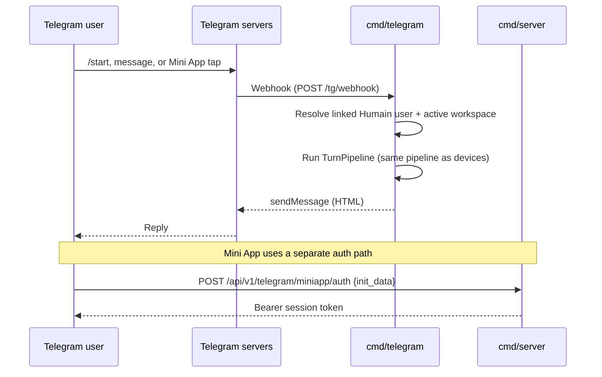

Humain Kiosk ships a dedicated Telegram integration with three parts that can be used
independently or together: a **bot** for managing kiosks and triggering AI replies in group
chats, a **Mini App** for full workspace management inside Telegram's WebView, and **Business
connections** that let a Telegram Business account auto-reply to customer chats with a kiosk's
AI persona.

<Info>
  Every Telegram feature requires the user to **link their Telegram account to a Humain account
  first**, from the admin panel (**Account → Linked accounts**) or via `/start` in the bot. There
  is no in-bot signup — an unlinked Telegram account gets a "Connect Telegram Account" prompt
  instead of a response.
</Info>

---

## Choose your integration

<Columns cols={2}>
  <Card title="Telegram bot" icon="robot" href="/telegram/bot">
    Manage kiosks, devices, and sessions with slash commands. Connect a group chat to a kiosk
    so mentioning the bot triggers a full AI conversation turn.
  </Card>
  <Card title="Mini App" icon="device-mobile" href="/telegram/mini-app">
    A full Next.js workspace app running inside Telegram's WebView — dashboards, kiosk and
    device management, session history, and billing.
  </Card>
  <Card title="Business connections" icon="briefcase" href="/telegram/business">
    Bind a kiosk to your personal Telegram account via Business Mode so the AI answers your
    customer DMs and channel messages on your behalf.
  </Card>
  <Card title="Stars payments" icon="star" href="/telegram/payments">
    Sell plan subscriptions and PAYG credit bundles with Telegram Stars — no external payment
    provider required.
  </Card>
</Columns>

---

## Architecture

Two separate processes serve Telegram traffic:

| Binary | Port | Responsibility |
|---|---|---|
| `cmd/server` | 8080 | OIDC login/connect, Mini App `initData` auth, Stars invoice creation. Owns the database schema. |
| `cmd/telegram` | 8082 | The live bot. Receives webhooks, runs the full AI turn pipeline, handles managed/business bots, relays platform notifications. Never migrates the schema. |

<Note>
  The bot is **webhook-only** — there is no long-polling fallback. `cmd/telegram` registers the
  webhook at startup using `TELEGRAM_WEBHOOK_URL` and validates every incoming request against
  `TELEGRAM_WEBHOOK_SECRET` via the `X-Telegram-Bot-Api-Secret-Token` header.
</Note>

Conversational turns in the bot run through the exact same `TurnPipeline` used by physical
devices — the same guardrails, knowledge retrieval, persona resolution, and tool-calling apply.
See [Session lifecycle](/concepts/session-lifecycle) for the underlying pipeline.

---

## Configuration reference

All Telegram environment variables are read once, in `config/config.go`.

| Variable | Purpose |
|---|---|
| `TELEGRAM_BOT_TOKEN` | BotFather bot token. Required for `cmd/telegram` to start. |
| `TELEGRAM_BOT_USERNAME` | Bot username (e.g. `humain_kiosk_bot`) — used for @mention detection and deep-link URLs. |
| `TELEGRAM_OIDC_CLIENT_ID` / `TELEGRAM_OIDC_CLIENT_SECRET` | Telegram Login Widget / OAuth credentials for "Sign in with Telegram" in the admin panel. |
| `TELEGRAM_OIDC_REDIRECT_URL` | OAuth callback URL, default `http://localhost:8080/api/v1/auth/telegram/callback`. |
| `TELEGRAM_WEBHOOK_URL` | Public URL Telegram delivers updates to (e.g. `https://api.humain.ai/tg/webhook`). |
| `TELEGRAM_WEBHOOK_SECRET` | Shared secret validated on every incoming webhook request. |
| `TELEGRAM_MINIAPP_URL` | Mini App deployment URL, default `http://localhost:3002`. Added to `cmd/server`'s CORS allow-list. |
| `TELEGRAM_PORT` | `cmd/telegram`'s HTTP port, default `8082`. |
| `ENCRYPTION_KEY` | Also used to encrypt managed (child) bot tokens at rest. |

See each sub-page for the BotFather setup steps specific to that feature (Web Login domain,
Mini App short names, Business Mode).

---

## Deployment

`kiosk-infra`'s Docker Compose defines two services: `telegram` (the bot, from
`kiosk-backend/Dockerfile.telegram`) and `miniapp` (the Next.js Mini App, from
`kiosk-miniapp/Dockerfile`). Both are disabled in the local dev override — run them on the host
instead (`air -c telegram.air.toml` for the bot, `npm run dev` in `kiosk-miniapp` for the app).
