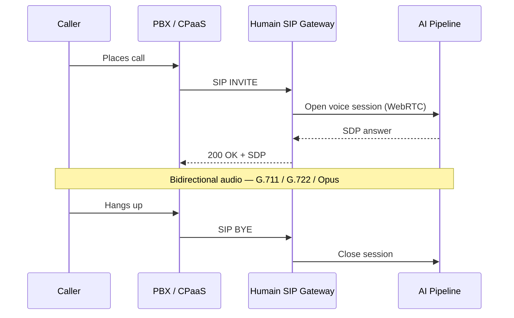

import VoipCredentialNote from '/snippets/voip-credential-note.mdx';

The Humain SIP gateway bridges telephone infrastructure to AI conversations. An incoming phone
call — from a PSTN line, a cloud telephony provider, or an IP phone — becomes a Humain Kiosk
session. Your PBX or CPaaS handles the telephone network; Humain handles the intelligence.

<VoipCredentialNote />

---

## Choose your integration path

<Columns cols={2}>
  <Card title="Asterisk / FreePBX (technical)" icon="server" href="/voip/asterisk-agi">
    Write a dialplan and AGI script to route calls to a Humain Kiosk session. Full control
    over call flow, DTMF handling, and mid-call transfers.
  </Card>
  <Card title="FreePBX module (no-code)" icon="puzzle" href="/plugins/freepbx">
    Install a GUI module from the FreePBX Module Admin. Configure the Humain extension from
    a form — no dialplan editing required.
  </Card>
  <Card title="3CX (no-code)" icon="headset" href="/plugins/3cx">
    Install a CallFlow app from the 3CX App Marketplace. Route calls to the Humain AI from
    any queue, IVR, or direct inward dial number.
  </Card>
  <Card title="Twilio" icon="cloud" href="/voip/twilio">
    Route Twilio phone numbers to a Humain Kiosk session via Media Streams and TwiML webhooks.
  </Card>
  <Card title="Vonage" icon="cloud" href="/voip/vonage">
    Connect Vonage Voice API calls to Humain using NCCO and WebSocket audio streaming.
  </Card>
  <Card title="Telnyx" icon="cloud" href="/voip/telnyx">
    Use Telnyx Call Control API to fork call audio to a Humain Kiosk voice session.
  </Card>
  <Card title="Generic SIP trunk" icon="network" href="/voip/sip-gateway">
    Register any SIP-capable endpoint directly to the Humain SIP gateway. Works with any
    standards-compliant PBX, softphone, or ATA.
  </Card>
</Columns>

---

## Call architecture

Every integration path converges on the same architecture. Your telephony layer sends a SIP
`INVITE` to the Humain gateway; the gateway opens a voice session with the AI pipeline and
bridges bidirectional audio.

<Info>
  The SIP gateway handles all codec transcoding and NAT traversal. Your PBX does not need to
  support Opus — G.711 (PCMU/PCMA) and G.722 are both supported on the SIP side. See the
  [codec guide](/voip/codec-guide) for the full compatibility matrix.
</Info>

---

## Conceptual background

For a deeper look at how VoIP sessions work — the session flow diagram, codec table, and
security requirements — see the [VoIP / SIP connection type](/connections/voip-sip) page in
the Guides tab.
