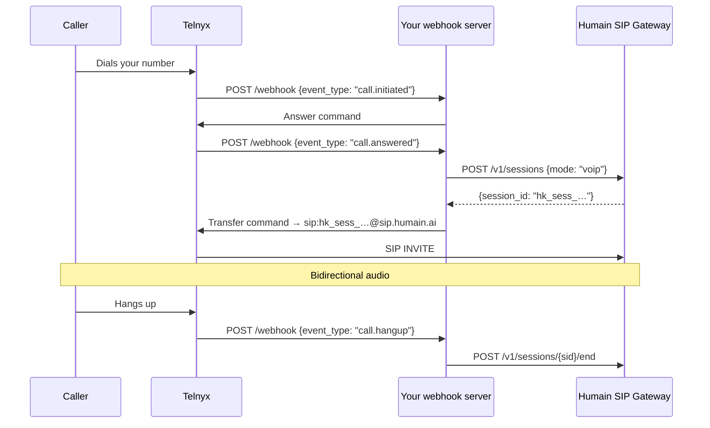

import VoipCredentialNote from '/snippets/voip-credential-note.mdx';

Telnyx's **Call Control API** is event-driven: Telnyx sends webhook events to your server for
each call state change, and your server responds with Call Control commands. You use the
`transfer` command to bridge the call audio to the Humain SIP gateway, or the `stream_start`
command to pipe audio over a WebSocket.

This guide uses the **SIP transfer approach**, which requires minimal server-side code and works
with any Telnyx voice plan.

<VoipCredentialNote />

---

## How it works



---

## Webhook handler

```javascript
import express from "express"

const app = express()
app.use(express.json())

const HUMAIN_CREDENTIAL  = process.env.HUMAIN_CREDENTIAL  // hk_live_…
const API_BASE           = process.env.HUMAIN_API_BASE ?? "https://api.humain.ai"
const TELNYX_API_KEY     = process.env.TELNYX_API_KEY     // KEY0…
const TELNYX_API_BASE    = "https://api.telnyx.com/v2"

const activeSessions = new Map() // callControlId → sessionId

// ─── Telnyx Call Control helpers ──────────────────────────────────────────────

async function callControlAction(callControlId, action, payload = {}) {
  const res = await fetch(
    `${TELNYX_API_BASE}/calls/${callControlId}/actions/${action}`,
    {
      method: "POST",
      headers: {
        "Authorization": `Bearer ${TELNYX_API_KEY}`,
        "Content-Type": "application/json",
      },
      body: JSON.stringify(payload),
    }
  )
  if (!res.ok) {
    const body = await res.text()
    throw new Error(`Telnyx ${action} failed (${res.status}): ${body}`)
  }
}

// ─── Humain API helpers ───────────────────────────────────────────────────────

async function openSession(metadata = {}) {
  const res = await fetch(`${API_BASE}/v1/sessions`, {
    method: "POST",
    headers: {
      "Authorization": `Bearer ${HUMAIN_CREDENTIAL}`,
      "Content-Type": "application/json",
    },
    body: JSON.stringify({ mode: "voip", metadata }),
  })
  if (!res.ok) throw new Error(`Failed to open session: ${res.status}`)
  const { session_id } = await res.json()
  return session_id
}

async function closeSession(sessionId) {
  await fetch(`${API_BASE}/v1/sessions/${sessionId}/end`, {
    method: "POST",
    headers: { "Authorization": `Bearer ${HUMAIN_CREDENTIAL}` },
  }).catch((err) => console.error("Could not close session:", err))
}

// ─── Webhook endpoint ─────────────────────────────────────────────────────────

app.post("/webhook", async (req, res) => {
  const { event_type, payload } = req.body?.data ?? {}
  const callControlId = payload?.call_control_id

  res.sendStatus(200) // acknowledge immediately

  switch (event_type) {
    case "call.initiated": {
      // Answer the call
      await callControlAction(callControlId, "answer")
      break
    }

    case "call.answered": {
      // Open a Humain session, then transfer
      try {
        const sessionId = await openSession({
          caller_id:       payload.from,
          did:             payload.to,
          call_control_id: callControlId,
        })
        activeSessions.set(callControlId, sessionId)

        // Transfer to Humain SIP gateway using the session_id as the SIP user
        await callControlAction(callControlId, "transfer", {
          to: `sip:${sessionId}@sip.humain.ai`,
          sip_auth_username: HUMAIN_CREDENTIAL,
          sip_auth_password: HUMAIN_CREDENTIAL,
        })
      } catch (err) {
        console.error("Failed to route to Humain:", err)
        await callControlAction(callControlId, "speak", {
          payload: "The AI assistant is temporarily unavailable.",
          voice: "female",
          language: "en-US",
        })
        await callControlAction(callControlId, "hangup")
      }
      break
    }

    case "call.hangup": {
      const sessionId = activeSessions.get(callControlId)
      if (sessionId) {
        activeSessions.delete(callControlId)
        await closeSession(sessionId)
      }
      break
    }

    default:
      // Ignore other events (call.bridged, etc.)
      break
  }
})

app.listen(3000, () => console.log("Telnyx webhook server on :3000"))
```

---

## Telnyx portal configuration

1. In the [Telnyx Mission Control Portal](https://portal.telnyx.com), go to **Call Control → Applications**.
2. Create a new application. Set **Webhook URL** to `https://your-server.example.com/webhook`.
3. Set **Webhook API Version** to **API v2**.
4. Under **Numbers**, assign your Telnyx number to the application.

<Note>
  Telnyx expects your webhook to return `200 OK` within **2 seconds** of receiving the event.
  The handler above responds `200` immediately before processing, which prevents timeouts even
  when the Humain API call takes 200–400 ms.
</Note>

---

## Verifying the integration

Use the Telnyx CLI to trigger a test call:

```bash
telnyx calls:create \
  --connection-id YOUR_APP_CONNECTION_ID \
  --from "+1YOUR_TELNYX_NUMBER" \
  --to "+1YOUR_TEST_NUMBER"
```

Watch your server logs for the event sequence:
`call.initiated` → `call.answered` → `call.bridged` → `call.hangup`.
