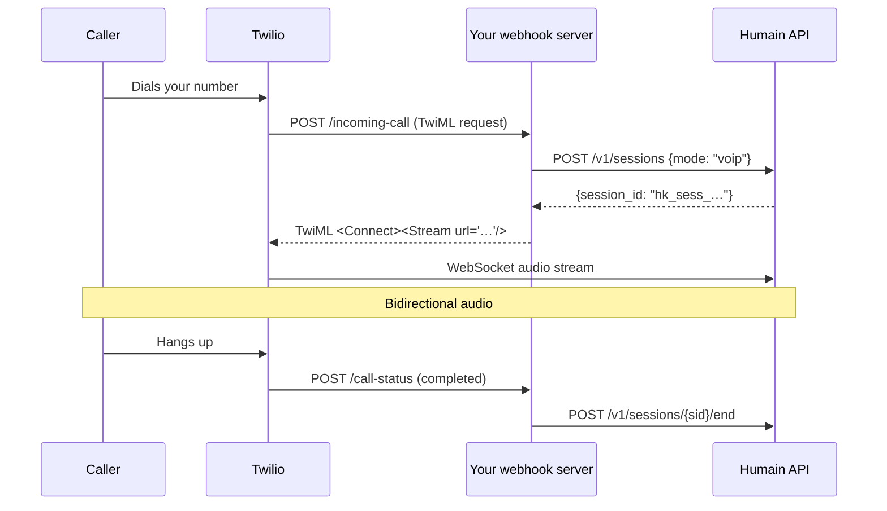

import VoipCredentialNote from '/snippets/voip-credential-note.mdx';

Twilio's **Media Streams** API sends raw audio from a call over a WebSocket to your server.
Your server opens a Humain Kiosk session, proxies the audio stream, and returns AI-generated
audio back to the caller — all in real time.

<VoipCredentialNote />

---

## How it works



---

## TwiML response

When Twilio calls your webhook, respond with this TwiML to start the audio stream:

```xml
<?xml version="1.0" encoding="UTF-8"?>
<Response>
  <Connect>
    <Stream url="wss://api.humain.ai/v1/voip/twilio/{session_id}" />
  </Connect>
</Response>
```

Replace `{session_id}` with the ID returned by `POST /v1/sessions`.

---

## Webhook handler

<Tabs>
  <Tab title="Node.js">
    ```javascript
    import express from "express"
    import VoiceResponse from "twilio/lib/twiml/VoiceResponse.js"

    const app = express()
    app.use(express.urlencoded({ extended: false }))

    const HUMAIN_CREDENTIAL = process.env.HUMAIN_CREDENTIAL // hk_live_…
    const API_BASE          = process.env.HUMAIN_API_BASE ?? "https://api.humain.ai"

    // Track active sessions so we can close them on hang-up
    const activeSessions = new Map() // callSid → sessionId

    // ─── Incoming call ────────────────────────────────────────────────────────

    app.post("/incoming-call", async (req, res) => {
      const { CallSid, From, To } = req.body

      // Open a Humain Kiosk voice session
      const sessionResp = await fetch(`${API_BASE}/v1/sessions`, {
        method: "POST",
        headers: {
          "Authorization": `Bearer ${HUMAIN_CREDENTIAL}`,
          "Content-Type": "application/json",
        },
        body: JSON.stringify({
          mode: "voip",
          metadata: { caller_id: From, did: To, call_sid: CallSid },
        }),
      })

      if (!sessionResp.ok) {
        // If we can't open a session, play an error message and hang up
        const twiml = new VoiceResponse()
        twiml.say("We're sorry, the AI assistant is temporarily unavailable. Please try again later.")
        return res.type("text/xml").send(twiml.toString())
      }

      const { session_id } = await sessionResp.json()
      activeSessions.set(CallSid, session_id)

      // Return TwiML to bridge the call audio to the Humain session
      const twiml = new VoiceResponse()
      const connect = twiml.connect()
      connect.stream({
        url: `wss://api.humain.ai/v1/voip/twilio/${session_id}`,
      })

      res.type("text/xml").send(twiml.toString())
    })

    // ─── Call status callback ─────────────────────────────────────────────────

    app.post("/call-status", async (req, res) => {
      const { CallSid, CallStatus } = req.body

      if (CallStatus === "completed" || CallStatus === "failed") {
        const sessionId = activeSessions.get(CallSid)
        if (sessionId) {
          activeSessions.delete(CallSid)
          await fetch(`${API_BASE}/v1/sessions/${sessionId}/end`, {
            method: "POST",
            headers: { "Authorization": `Bearer ${HUMAIN_CREDENTIAL}` },
          }).catch((err) => console.error("Failed to close session:", err))
        }
      }

      res.sendStatus(204)
    })

    app.listen(3000, () => console.log("Webhook server running on :3000"))
    ```
  </Tab>
  <Tab title="Python">
    ```python
    import os
    from flask import Flask, request, Response
    import requests as http
    from twilio.twiml.voice_response import VoiceResponse, Connect, Stream

    app = Flask(__name__)

    HUMAIN_CREDENTIAL = os.environ["HUMAIN_CREDENTIAL"]  # hk_live_…
    API_BASE = os.environ.get("HUMAIN_API_BASE", "https://api.humain.ai")

    # Track active sessions: call_sid → session_id
    active_sessions: dict[str, str] = {}


    @app.post("/incoming-call")
    def incoming_call():
        call_sid = request.form["CallSid"]
        caller   = request.form.get("From", "unknown")
        did      = request.form.get("To",   "unknown")

        # Open a Humain voice session
        resp = http.post(
            f"{API_BASE}/v1/sessions",
            json={
                "mode": "voip",
                "metadata": {"caller_id": caller, "did": did, "call_sid": call_sid},
            },
            headers={"Authorization": f"Bearer {HUMAIN_CREDENTIAL}"},
            timeout=10,
        )

        twiml = VoiceResponse()

        if not resp.ok:
            twiml.say("We're sorry, the AI assistant is temporarily unavailable.")
            return Response(str(twiml), mimetype="text/xml")

        session_id = resp.json()["session_id"]
        active_sessions[call_sid] = session_id

        connect = Connect()
        connect.stream(url=f"wss://api.humain.ai/v1/voip/twilio/{session_id}")
        twiml.append(connect)

        return Response(str(twiml), mimetype="text/xml")


    @app.post("/call-status")
    def call_status():
        call_sid   = request.form["CallSid"]
        call_status = request.form.get("CallStatus")

        if call_status in ("completed", "failed"):
            session_id = active_sessions.pop(call_sid, None)
            if session_id:
                try:
                    http.post(
                        f"{API_BASE}/v1/sessions/{session_id}/end",
                        headers={"Authorization": f"Bearer {HUMAIN_CREDENTIAL}"},
                        timeout=5,
                    )
                except Exception as exc:
                    app.logger.warning("Could not close session %s: %s", session_id, exc)

        return "", 204


    if __name__ == "__main__":
        app.run(port=3000)
    ```
  </Tab>
</Tabs>

---

## Twilio console configuration

1. In the [Twilio Console](https://console.twilio.com), open **Phone Numbers → Manage → Active numbers**.
2. Click your number and scroll to **Voice Configuration**.
3. Set **A call comes in** → **Webhook** → `https://your-server.example.com/incoming-call` (HTTP POST).
4. Set **Call status changes** → `https://your-server.example.com/call-status` (HTTP POST).
5. Save.

<Note>
  Your webhook server must be publicly reachable by Twilio. During local development, use
  [ngrok](https://ngrok.com) or the [Twilio CLI](https://www.twilio.com/docs/twilio-cli) to
  expose your local port.
</Note>

---

## Testing

Use the Twilio CLI to place a test call:

```bash
twilio api:core:calls:create \
  --from "+1YOUR_TWILIO_NUMBER" \
  --to "+1YOUR_TEST_NUMBER" \
  --url "https://your-server.example.com/incoming-call"
```

Or dial your Twilio number from any phone.
