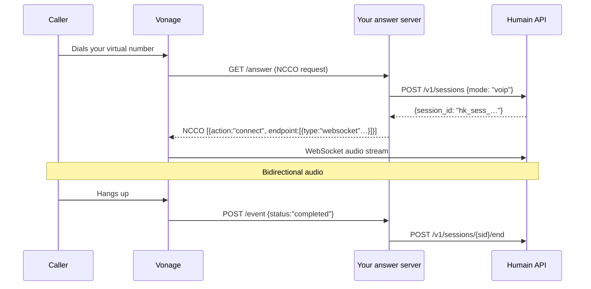

import VoipCredentialNote from '/snippets/voip-credential-note.mdx';

Vonage's **Voice API** uses an **NCCO (Nexmo Call Control Object)** to control call flow and
streams audio over a WebSocket to your application. Your server opens a Humain Kiosk session and
passes the WebSocket URL to Vonage — Vonage bridges the caller's audio to the Humain AI.

<VoipCredentialNote />

---

## How it works

When a call arrives, Vonage fetches an **answer URL** from your server. You respond with an NCCO
JSON array that includes a `connect` action pointing at the Humain WebSocket stream endpoint.



---

## NCCO response

```json
[
  {
    "action": "connect",
    "from": "VONAGE_VIRTUAL_NUMBER",
    "endpoint": [
      {
        "type": "websocket",
        "uri": "wss://api.humain.ai/v1/voip/vonage/{session_id}",
        "content-type": "audio/l16;rate=16000",
        "headers": {
          "session_id": "{session_id}"
        }
      }
    ]
  }
]
```

---

## Answer server

<Tabs>
  <Tab title="Node.js">
    ```javascript
    import express from "express"

    const app = express()
    app.use(express.json())
    app.use(express.urlencoded({ extended: true }))

    const HUMAIN_CREDENTIAL = process.env.HUMAIN_CREDENTIAL  // hk_live_…
    const API_BASE          = process.env.HUMAIN_API_BASE ?? "https://api.humain.ai"
    const VONAGE_NUMBER     = process.env.VONAGE_NUMBER       // e.g. "447700900001"

    const activeSessions = new Map() // uuid → sessionId

    // ─── Answer URL ───────────────────────────────────────────────────────────

    app.get("/answer", async (req, res) => {
      const { uuid, from, to } = req.query

      // Open a Humain Kiosk voice session
      const sessionResp = await fetch(`${API_BASE}/v1/sessions`, {
        method: "POST",
        headers: {
          "Authorization": `Bearer ${HUMAIN_CREDENTIAL}`,
          "Content-Type": "application/json",
        },
        body: JSON.stringify({
          mode: "voip",
          metadata: { caller_id: from, did: to, vonage_uuid: uuid },
        }),
      })

      if (!sessionResp.ok) {
        // Fall back to a voice message
        return res.json([{ action: "talk", text: "The AI assistant is temporarily unavailable." }])
      }

      const { session_id } = await sessionResp.json()
      activeSessions.set(uuid, session_id)

      // Return the NCCO
      res.json([
        {
          action: "connect",
          from: VONAGE_NUMBER,
          endpoint: [
            {
              type: "websocket",
              uri: `wss://api.humain.ai/v1/voip/vonage/${session_id}`,
              "content-type": "audio/l16;rate=16000",
              headers: { session_id },
            },
          ],
        },
      ])
    })

    // ─── Event URL ────────────────────────────────────────────────────────────

    app.post("/event", async (req, res) => {
      const { uuid, status } = req.body

      if (status === "completed" || status === "failed") {
        const sessionId = activeSessions.get(uuid)
        if (sessionId) {
          activeSessions.delete(uuid)
          fetch(`${API_BASE}/v1/sessions/${sessionId}/end`, {
            method: "POST",
            headers: { "Authorization": `Bearer ${HUMAIN_CREDENTIAL}` },
          }).catch((err) => console.error("Failed to close session:", err))
        }
      }

      res.sendStatus(204)
    })

    app.listen(3000, () => console.log("Vonage answer server on :3000"))
    ```
  </Tab>
  <Tab title="Python">
    ```python
    import os
    from flask import Flask, request, jsonify
    import requests as http

    app = Flask(__name__)

    HUMAIN_CREDENTIAL = os.environ["HUMAIN_CREDENTIAL"]
    API_BASE          = os.environ.get("HUMAIN_API_BASE", "https://api.humain.ai")
    VONAGE_NUMBER     = os.environ["VONAGE_NUMBER"]

    active_sessions: dict[str, str] = {}


    @app.get("/answer")
    def answer():
        uuid   = request.args.get("uuid")
        caller = request.args.get("from", "unknown")
        did    = request.args.get("to",   "unknown")

        resp = http.post(
            f"{API_BASE}/v1/sessions",
            json={
                "mode": "voip",
                "metadata": {"caller_id": caller, "did": did, "vonage_uuid": uuid},
            },
            headers={"Authorization": f"Bearer {HUMAIN_CREDENTIAL}"},
            timeout=10,
        )

        if not resp.ok:
            return jsonify([{"action": "talk", "text": "The AI assistant is temporarily unavailable."}])

        session_id = resp.json()["session_id"]
        active_sessions[uuid] = session_id

        return jsonify([
            {
                "action": "connect",
                "from": VONAGE_NUMBER,
                "endpoint": [
                    {
                        "type": "websocket",
                        "uri": f"wss://api.humain.ai/v1/voip/vonage/{session_id}",
                        "content-type": "audio/l16;rate=16000",
                        "headers": {"session_id": session_id},
                    }
                ],
            }
        ])


    @app.post("/event")
    def event():
        data       = request.get_json(force=True) or {}
        uuid       = data.get("uuid")
        status     = data.get("status")

        if status in ("completed", "failed"):
            session_id = active_sessions.pop(uuid, None)
            if session_id:
                try:
                    http.post(
                        f"{API_BASE}/v1/sessions/{session_id}/end",
                        headers={"Authorization": f"Bearer {HUMAIN_CREDENTIAL}"},
                        timeout=5,
                    )
                except Exception as exc:
                    app.logger.warning("Could not close session %s: %s", session_id, exc)

        return "", 204


    if __name__ == "__main__":
        app.run(port=3000)
    ```
  </Tab>
</Tabs>

---

## Vonage dashboard configuration

1. Open the [Vonage API Dashboard](https://dashboard.nexmo.com) and go to **Your applications**.
2. Create a new Voice application, or edit an existing one.
3. Under **Capabilities → Voice**, set:
   - **Answer URL** → `GET https://your-server.example.com/answer`
   - **Event URL** → `POST https://your-server.example.com/event`
4. Link your virtual number to the application under **Numbers**.

<Note>
  Vonage requires your answer URL to respond within **3 seconds**. The Humain API call in the
  answer handler typically responds in under 300 ms, well within this limit.
</Note>
